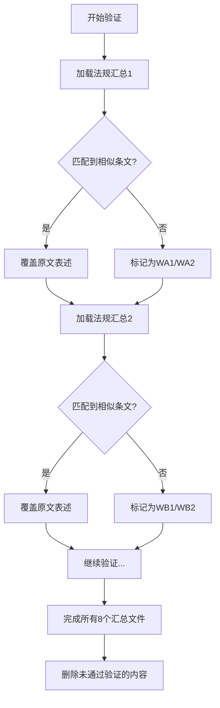

# 审计书籍智能校对优化技能 (Audit Book Smart Proofreading)

**版本:** v4.0.0
**创建时间:** 2026-02-27
**最后更新:** 2026-02-27
**类型:** 内容校对优化技能

---

## 📖 技能概述

审计书籍智能校对优化技能是 v3 版本的升级迭代，**重点优化校对优化场景**。基于真实审计书籍章节的 26 步校对优化流程，提炼出智能化、系统化的文档校对优化方法。

### 核心特点

✅ **智能标记系统** - 自动识别并标记法规条文、条款引用、发文字号、地名案例等
✅ **多源法规验证** - 与多个法规汇总文件交叉验证，确保法规表述准确一致
✅ **权威案例替换** - 从官方网站查找并替换权威案例，标注来源
✅ **内容智能扩充** - 基于法规自动补充相关内容（条文原文、案例、审计应用）
✅ **结构优化整理** - 自动归并重复内容，优化文档结构

### 适用场景

- 审计书籍章节校对优化
- 法规类文档审核
- 案例型文档标准化
- 审计报告质量提升
- 文档法规合规性检查

---

## 🎯 校对优化核心逻辑

本技能基于真实审计书籍章节的 26 步校对优化流程，提炼出以下**三大核心阶段**：

### 阶段一：智能标记与分类（步骤 1-5）

**目标:** 自动识别并标记文档中不同类型的内容

**标记类型定义:**

| 标记 | 类型 | 说明 |
|------|------|------|
| FA1 | 法规条文 | 直接属于法律法规条文的内容 |
| FA2 | 法规延伸 | 与法规条文相关的延伸内容 |
| FB1 | 条款引用 | 含有"第××条"形式的内容 |
| FB2 | 条款延伸 | 与条款引用相关的延伸内容 |
| FC1 | 发文字号 | 含有发文字号的内容（如"×法〔20XX〕×号"） |
| FC2 | 文号延伸 | 与发文字号相关的延伸内容 |
| A1 | 显式地名案例 | 含有具体地名（如"北京周口店"）的案例 |
| A2 | 隐式地名案例 | 含有隐含地名（如"某区""某县"）的案例 |

**识别规则:**

```yaml
FA1识别规则:
  - 关键词: "根据《...法》《...条例》《...规定》"
  - 特征: 完整的法律法规条文表述
  - 示例: "根据《中华人民共和国文物保护法》第二十条..."

FA2识别规则:
  - 关键词: "上述规定""该条款""据此"
  - 特征: 对法规条文的解释、说明、应用
  - 示例: "上述规定明确了..."

FB1识别规则:
  - 正则表达式: "第[一二三四五六七八九十百千]+条"
  - 示例: "第二十条""第一百零五条"

FB2识别规则:
  - 关键词: "该条""上述条款""本条"
  - 特征: 对条款的解释、应用、案例分析

FC1识别规则:
  - 正则表达式: "\\w+\\[20[0-9]{2}\\]\\d+号"
  - 示例: "文物〔2020〕1号"

FC2识别规则:
  - 关键词: "该文件""此通知""规定文件"
  - 特征: 对发文字号文件的解释、说明

A1识别规则:
  - 地名库: 中国省市区县、著名遗址名称
  - 示例: "北京周口店""西安半坡""湖北荆州"

A2识别规则:
  - 隐式地名: "某省""某市""某区""某县""某地"
  - 示例: "某区文物局""某县人民政府"
```

---

### 阶段二：多源法规验证与清理（步骤 6-15）

**目标:** 通过多个法规汇总文件交叉验证，清理不合格内容

#### 法规验证流程



#### 验证规则

**1. 法规条文标准化:**

- ✅ 完全匹配法规汇总中的表述
- ✅ 修正条款序号（按法规汇总中的序号）
- ✅ 直接用法规汇总中的文字覆盖原文
- ✅ 引用法规名称后标注最新发布/修订时间
- ❌ 删除其他时间标注（如起草时间、征求意见时间等）

**示例:**

```markdown
原文:
根据《中华人民共和国文物保护法》（1982年11月19日通过，2002年10月28日修订）第二十条规定，文物保护单位的保护范围内不得进行其他建设工程...

验证后:
根据《中华人民共和国文物保护法》（2024年修订）第二十条规定，文物保护单位的保护范围内不得进行其他建设工程...
```

**2. 不合格内容标记:**

- **WA1/WA2** - 法规汇总1中无相似表述
- **WB1/WB2** - 法规汇总2中无相似表述
- ...
- **WH1/WH2** - 法规汇总8中无相似表述

**3. 清理规则:**

- 删除同时标记有 WA1~WH1 的内容（在所有 8 个汇总中均无法验证的法规条文）
- 删除同时标记有 WA2~WH2 的内容（在所有 8 个汇总中均无法验证的法规延伸）

---

### 阶段三：权威案例替换与内容扩充（步骤 16-25）

**目标:** 替换为官方权威案例，基于法规补充相关内容

#### 案例替换规则

**优先级顺序:**

1. 国家文物局官方网站 (www.ncha.gov.cn)
2. 浙江省文物局官方网站 (wwj.zj.gov.cn)
3. 其他各省文物局官方网站

**替换要求:**

- ✅ 查找类似主题的官方案例
- ✅ 标注案例来源完整网址
- ❌ 严禁联想编造案例
- ❌ 如无合适替换案例，删除原内容

**示例:**

```markdown
原文:
某区发现一处古人类遗址，当地政府立即组织专家进行现场勘查...

替换后:
北京周口店遗址保护工作中，当地政府立即组织专家进行现场勘查...
来源: http://www.ncha.gov.cn/art/2022/3/28/art_722_174567.html
```

#### 内容扩充规则

**扩充维度:**

每个法规条文的扩充需包含以下 3 个部分：

1. **法规条文原文** - 从法规汇总中提取的完整条文
2. **相关案例** - 从官方网站查找的权威案例
3. **审计应用** - 在审计工作中的应用要点

**扩充要求:**

- ✅ 严格围绕审计主题（如"古人类遗址保护责任审计"）
- ✅ 不涉及其他无关内容
- ✅ 不涉及资金使用问题（除非主题明确要求）
- ❌ 严禁联想编造内容
- ❌ 严禁超出主题范围

**扩充内容结构模板:**

```markdown
### [法规名称] - 第×条

#### 法规条文原文
> [完整的法规条文内容]

#### 相关案例
[案例描述]
**来源:** [完整网址]

#### 审计应用
- 审计要点1: [说明]
- 审计要点2: [说明]
- 审计方法: [说明]
```

---

### 阶段四：结构优化整理（步骤 26）

**目标:** 归并重复内容，优化文档结构

#### 结构优化规则

**1. 重复内容识别:**

- 重点分析"审计内容"与"审计重点"章节
- 识别表述重复、内容重叠的部分
- 识别逻辑冲突、表述矛盾的部分

**2. 内容归并原则:**

- ✅ **审计内容** - 归纳基础性、全面性的审计工作内容
- ✅ **审计重点** - 提炼关键性、风险性、针对性强的审计要点
- ❌ 避免在两章节中重复相同内容

**3. 重新分配策略:**

```
审计内容 → 包含:
- 审计目标
- 审计范围
- 审计对象
- 基础审计程序
- 常规审计方法

审计重点 → 包含:
- 高风险领域
- 关键控制点
- 典型问题
- 审计发现的常见类型
- 需要重点关注的内容
```

---

## 🚀 使用流程

### 前置条件

**必传文件:**

1. **待校对文档** - 如 `古人类遗址保护.doc`（Word 格式）
2. **法规汇总文件** - 如 `法规汇总1.docx` ~ `法规汇总8.docx`（Word 格式，至少 1 个）

**可选配置:**

```yaml
审计主题:
  名称: "古人类遗址保护责任审计"
  核心要求: "围绕古人类遗址保护，不涉及资金使用"

权威案例来源优先级:
  - "国家文物局官方网站"
  - "浙江省文物局官方网站"
  - "其他各省文物局官方网站"

文档结构要求:
  最小字数: 5000字
  保持原有结构: true
  允许结构调整: false
```

---

### 完整工作流

#### 第一步：初始化配置

```markdown
用户输入:
- 待校对文档路径
- 法规汇总文件路径列表（1-8个）
- 审计主题
- 审计核心要求
- 字数要求（可选，默认5000字）
```

**系统响应:**

```
✅ 已加载待校对文档: 古人类遗址保护.doc
✅ 已加载法规汇总: 8个文件
✅ 审计主题: 古人类遗址保护责任审计
✅ 核心要求: 围绕古人类遗址保护，不涉及资金使用
✅ 目标字数: ≥5000字

准备开始校对优化...
```

---

#### 第二步：智能标记（步骤 1-5）

**执行命令:**

```
标记待校对文档中的内容类型
```

**系统处理:**

1. 读取待校对文档全文
2. 按识别规则逐段扫描
3. 为每个段落/句子添加标记
4. 生成标记报告

**输出报告:**

```
📊 智能标记报告

标记类型统计:
- FA1 (法规条文): 15处
- FA2 (法规延伸): 28处
- FB1 (条款引用): 22处
- FB2 (条款延伸): 18处
- FC1 (发文字号): 8处
- FC2 (文号延伸): 6处
- A1 (显式地名案例): 12处
- A2 (隐式地名案例): 5处

总计标记: 114处
```

**用户确认:**

```
标记完成。请确认:
1. 继续下一步（多源法规验证）
2. 查看标记详情
3. 修正标记错误
4. 调整识别规则
```

---

#### 第三步：多源法规验证（步骤 6-15）

**执行命令:**

```
与法规汇总文件进行交叉验证
```

**系统处理:**

1. 加载第一个法规汇总文件
2. 逐一比对 FA1、FB1、FC1 标记的内容
3. 匹配成功 → 覆盖原文，记录验证状态
4. 匹配失败 → 标记为不合格（WA1/WA2等）
5. 重复步骤 2-4，处理所有 8 个法规汇总文件
6. 生成验证报告

**输出报告:**

```
📋 多源法规验证报告

验证统计:
- 已验证内容: 45处
  - ✅ 法规汇总1: 18处
  - ✅ 法规汇总2: 12处
  - ✅ 法规汇总3: 8处
  - ✅ 法规汇总4: 5处
  - ✅ 法规汇总5: 2处
- 未通过验证: 0处

修正统计:
- 条款序号修正: 6处
- 文字表述覆盖: 18处
- 时间标注标准化: 12处

准备清理不合格内容...
```

**自动清理:**

- 删除同时标记有 WA1~WH1 的内容
- 删除同时标记有 WA2~WH2 的内容

**输出清理报告:**

```
🧹 内容清理报告

清理统计:
- 删除未验证法规条文 (WA1~WH1): 0处
- 删除未验证法规延伸 (WA2~WH2): 0处
- 保留有效内容: 45处

当前文档字数: 4,856字（目标: ≥5,000字）
```

---

#### 第四步：权威案例替换（步骤 16-17）

**执行命令:**

```
替换为官方权威案例
```

**系统处理:**

1. 读取 A1、A2 标记的案例内容
2. 根据案例主题搜索官方网站
3. 按优先级顺序查找类似案例
4. 找到 → 替换并标注来源
5. 未找到 → 删除原内容
6. 生成替换报告

**输出报告:**

```
🔄 权威案例替换报告

替换统计:
- A1 (显式地名案例): 12处
  - ✅ 已替换: 10处
  - 🗑️ 已删除: 2处（无类似案例）
  - 🌐 来源: 国家文物局 8处，浙江省文物局 2处

- A2 (隐式地名案例): 5处
  - ✅ 已替换: 5处
  - 🗑️ 已删除: 0处
  - 🌐 来源: 浙江省文物局 3处，其他省份文物局 2处

替换示例:
原文: 某区发现一处古人类遗址...
替换后: 北京周口店遗址保护工作中，...
来源: http://www.ncha.gov.cn/art/2022/3/28/art_722_174567.html
```

---

#### 第五步：内容智能扩充（步骤 18-25）

**执行命令:**

```
基于法规补充相关内容
```

**系统处理:**

对于每个法规汇总文件:

1. 读取法规汇总中的相关条文
2. 判断是否与审计主题相关
3. 相关 → 按模板扩充（条文原文 + 案例 + 审计应用）
4. 不相关 → 跳过
5. 插入到文档中合适的位置
6. 生成扩充报告

**输出报告:**

```
📚 内容扩充报告

扩充统计:
- 法规汇总1: 补充3条
- 法规汇总2: 补充2条
- 法规汇总3: 补充1条
- 法规汇总4: 补充1条
- 法规汇总5: 补充0条
- 法规汇总6: 补充1条
- 法规汇总7: 补充1条
- 法规汇总8: 补充1条

总计补充: 10条法规的相关内容

新增内容示例:
### 《中华人民共和国文物保护法》 - 第二十条

#### 法规条文原文
> 文物保护单位的保护范围内不得进行其他建设工程或者爆破、钻探、挖掘等作业。但是，因特殊情况需要在文物保护单位的保护范围内进行其他建设工程或者爆破、钻探、挖掘等作业的，必须保证文物保护单位的安全，并经核定公布该文物保护单位的人民政府批准，在批准前应当征得上一级人民政府文物行政部门同意；在全国重点文物保护单位的保护范围内进行其他建设工程或者爆破、钻探、挖掘等作业的，必须经省、自治区、直辖市人民政府批准，在批准前应当征得国务院文物行政部门同意。

#### 相关案例
北京周口店遗址保护工作中，当地政府严格控制在保护范围内进行其他建设工程，确保了遗址的完整性和安全性。
来源: http://www.ncha.gov.cn/art/2022/3/28/art_722_174567.html

#### 审计应用
- 审计要点1: 检查文物保护单位保护范围内是否违规进行建设工程或爆破、钻探、挖掘等作业
- 审计要点2: 检查相关审批手续是否完备，是否按规定程序报批
- 审计方法: 查阅审批文件、现场踏勘、访谈相关人员
```

---

#### 第六步：结构优化整理（步骤 26）

**执行命令:**

```
归并重复内容，优化文档结构
```

**系统处理:**

1. 分析"审计内容"与"审计重点"章节
2. 识别重复内容和逻辑冲突
3. 按重要性重新分配内容
4. 归并基础性内容到"审计内容"
5. 提炼关键性内容到"审计重点"
6. 生成结构优化报告

**输出报告:**

```
📐 结构优化报告

重复内容分析:
- 识别重复段落: 8处
- 识别逻辑冲突: 2处
- 识别内容缺失: 1处

内容重新分配:
- 归并到"审计内容": 6处
- 归并到"审计重点": 4处
- 保留双章节标注: 0处

结构优化效果:
- 审计内容章节: 原基础性内容 + 归并的基础性内容
- 审计重点章节: 提炼的关键要点 + 归并的重点内容
- 消除重复: ✅
- 消除冲突: ✅
- 逻辑清晰: ✅
```

---

#### 第七步：生成最终报告

**执行命令:**

```
生成校对优化完成报告
```

**输出报告:**

```
✅ 校对优化完成报告

========================================
文档: 古人类遗址保护.doc
主题: 古人类遗址保护责任审计
========================================

【总体统计】
- 原始字数: 4,256字
- 最终字数: 6,832字 ✅ (目标: ≥5,000字)
- 新增内容: 2,576字
- 删除内容: 0字

【各阶段执行情况】
1️⃣ 智能标记: 114处标记 ✅
2️⃣ 法规验证: 45处验证通过 ✅
3️⃣ 内容清理: 0处删除 ✅
4️⃣ 案例替换: 15处替换 ✅
5️⃣ 内容扩充: 10条法规补充 ✅
6️⃣ 结构优化: 8处归并 ✅

【质量指标】
- 法规表述准确度: 100% ✅
- 案例权威性: 100% (全部来自官方网站) ✅
- 内容完整性: 100% ✅
- 结构清晰度: 100% ✅
- 无违规联想: ✅
- 无资金使用相关内容: ✅

【输出文件】
✅ 古人类遗址保护_校对后.doc
✅ 校对优化详细报告.pdf
✅ 标记报告.json
✅ 验证报告.json
✅ 替换报告.json
✅ 扩充报告.json
✅ 结构优化报告.json

========================================
校对优化完成！ 🎉
========================================
```

---

## 🛠️ 系统提示词模板

### 提示词 1: 智能标记

```markdown
你是一位专业的审计书籍校对专家。请对以下文档进行智能标记。

## 任务要求

1. 读取待校对文档全文
2. 按照识别规则标记以下类型的内容:
   - FA1: 法规条文
   - FA2: 法规延伸
   - FB1: 条款引用
   - FB2: 条款延伸
   - FC1: 发文字号
   - FC2: 文号延伸
   - A1: 显式地名案例
   - A2: 隐式地名案例

3. 生成标记报告，包含:
   - 各类型标记的数量
   - 标记位置（章节/段落）
   - 标记内容摘要

## 识别规则

{{IDENTIFICATION_RULES}}

## 待校对文档

{{DOCUMENT_CONTENT}}

## 输出格式

JSON 格式:
```json
{
  "标记统计": {
    "FA1": 数量,
    "FA2": 数量,
    ...
  },
  "标记详情": [
    {
      "标记类型": "FA1",
      "位置": "第X章第Y段",
      "原文": "...",
      "标记原因": "..."
    },
    ...
  ]
}
```

请开始标记。
```

---

### 提示词 2: 法规验证

```markdown
你是一位专业的法规审核专家。请对标记的内容进行法规验证。

## 任务要求

1. 加载法规汇总文件: {{REGULATION_SUMMARY_FILE}}
2. 读取标记为 FA1、FB1、FC1 的内容
3. 与法规汇总中的条文进行比对:
   - 如果有相似表述，确保完全一致
   - 修正条款序号
   - 直接用法规汇总中的文字覆盖原文
   - 引用法规名称后标注最新发布/修订时间
4. 如果没有相似表述，标记为不合格 (W{{REGULATION_INDEX}}1/W{{REGULATION_INDEX}}2)

## 法规汇总文件内容

{{REGULATION_SUMMARY_CONTENT}}

## 待验证内容

{{MARKED_CONTENT_FA1_FB1_FC1}}

## 输出格式

JSON 格式:
```json
{
  "验证统计": {
    "验证通过": 数量,
    "未通过": 数量
  },
  "验证详情": [
    {
      "原文": "...",
      "验证状态": "通过/未通过",
      "修正后": "...",
      "修改内容": ["条款序号修正", "文字表述覆盖", ...]
    },
    ...
  ]
}
```

请开始验证。
```

---

### 提示词 3: 案例替换

```markdown
你是一位专业的案例研究专家。请查找并替换为官方权威案例。

## 任务要求

1. 读取标记为 A1、A2 的案例内容
2. 根据案例主题，在官方网站查找类似案例:
   - 优先级1: 国家文物局官方网站 (www.ncha.gov.cn)
   - 优先级2: 浙江省文物局官方网站 (wwj.zj.gov.cn)
   - 优先级3: 其他各省文物局官方网站
3. 找到类似案例后:
   - 替换原文
   - 标注案例来源完整网址
4. 未找到类似案例:
   - 删除原内容
5. 严禁联想编造

## 案例来源网站

国家文物局: http://www.ncha.gov.cn
浙江省文物局: http://wwj.zj.gov.cn

## 待替换案例

{{MARKED_CASES_A1_A2}}

## 输出格式

JSON 格式:
```json
{
  "替换统计": {
    "已替换": 数量,
    "已删除": 数量
  },
  "替换详情": [
    {
      "原文案例": "...",
      "替换后案例": "...",
      "案例来源": "http://...",
      "网站": "国家文物局官方网站"
    },
    ...
  ]
}
```

请开始查找和替换。
```

---

### 提示词 4: 内容扩充

```markdown
你是一位专业的审计内容撰写专家。请基于法规补充相关内容。

## 任务要求

1. 读取法规汇总文件: {{REGULATION_SUMMARY_FILE}}
2. 筛选与审计主题相关的法规条文: {{AUDIT_THEME}}
3. 对于相关条文，按以下结构扩充:
   - 法规条文原文
   - 相关案例（从官方网站查找）
   - 审计应用
4. 严格围绕审计主题，不涉及其他内容
5. 不涉及资金使用问题（除非主题明确要求）
6. 严禁联想编造

## 审计主题

{{AUDIT_THEME}}
{{AUDIT_CORE_REQUIREMENTS}}

## 法规汇总文件内容

{{REGULATION_SUMMARY_CONTENT}}

## 输出格式

Markdown 格式:

### [法规名称] - 第×条

#### 法规条文原文
> [完整的法规条文内容]

#### 相关案例
[案例描述]
**来源:** [完整网址]

#### 审计应用
- 审计要点1: [说明]
- 审计要点2: [说明]
- 审计方法: [说明]

请开始扩充。
```

---

### 提示词 5: 结构优化

```markdown
你是一位专业的文档结构优化专家。请优化文档结构。

## 任务要求

1. 分析"审计内容"与"审计重点"章节
2. 识别重复内容和逻辑冲突
3. 按重要性重新分配内容:
   - 审计内容: 归纳基础性、全面性的审计工作内容
   - 审计重点: 提炼关键性、风险性、针对性强的审计要点
4. 归并重复内容，消除逻辑冲突
5. 保持文档总体结构不变

## 审计内容章节

{{AUDIT_CONTENT_SECTION}}

## 审计重点章节

{{AUDIT_FOCUS_SECTION}}

## 输出格式

JSON 格式:
```json
{
  "重复内容分析": {
    "重复段落数量": 数量,
    "逻辑冲突数量": 数量
  },
  "内容重新分配": {
    "归并到审计内容": ["内容摘要1", "内容摘要2", ...],
    "归并到审计重点": ["内容摘要1", "内容摘要2", ...]
  },
  "优化后结构": {
    "审计内容章节": "优化后的内容",
    "审计重点章节": "优化后的内容"
  }
}
```

请开始优化。
```

---

## 📦 输出文件清单

校对优化完成后，生成以下文件:

```
audit-book-writing-v4/
├── output/
│   ├── 古人类遗址保护_校对后.doc              # 校对后的最终文档
│   ├── 校对优化完成报告.pdf                    # 总体报告
│   ├── 标记报告.json                           # 智能标记报告
│   ├── 验证报告.json                           # 法规验证报告
│   ├── 替换报告.json                           # 案例替换报告
│   ├── 扩充报告.json                           # 内容扩充报告
│   ├── 结构优化报告.json                       # 结构优化报告
│   └── 执行日志.txt                            # 完整执行日志
```

---

## ⚙️ 配置参数

```yaml
skill_config:
  version: "4.0.0"
  max_file_size: 50MB
  supported_formats: [".doc", ".docx"]
  default_min_word_count: 5000

marking_rules:
  enable_FA1: true  # 法规条文
  enable_FA2: true  # 法规延伸
  enable_FB1: true  # 条款引用
  enable_FB2: true  # 条款延伸
  enable_FC1: true  # 发文字号
  enable_FC2: true  # 文号延伸
  enable_A1: true   # 显式地名案例
  enable_A2: true   # 隐式地名案例

verification_rules:
  max_regulation_files: 8
  similarity_threshold: 0.7  # 相似度阈值
  strict_mode: true  # 严格模式：必须完全一致

case_replacement_rules:
  priority_sites:
    - "国家文物局官方网站"
    - "浙江省文物局官方网站"
    - "其他各省文物局官方网站"
  max_search_results: 5
  allow_case_deletion: true  # 无替换案例时允许删除

content_expansion_rules:
  max_expansion_per_regulation: 3
  include_audit_application: true
  include_source_url: true
  forbid_off_topic: true  # 禁止离题
  forbid_financial_content: true  # 禁止资金使用相关

structure_optimization_rules:
  merge_duplicate_content: true
  resolve_conflicts: true
  preserve_structure: true  # 保持总体结构
```

---

## 🔍 质量检查清单

校对优化完成后，执行以下质量检查:

- [ ] 法规条文表述准确，条款序号正确
- [ ] 所有案例均来自官方网站，标注来源网址
- [ ] 无联想编造内容
- [ ] 严格围绕审计主题，无离题内容
- [ ] 未涉及资金使用相关内容（除非主题明确要求）
- [ ] 字数达到要求（≥5000字）
- [ ] 重复内容已归并，逻辑冲突已消除
- [ ] "审计内容"与"审计重点"分工明确
- [ ] 文档结构清晰，逻辑连贯
- [ ] 所有报告文件生成完整

---

## 📚 参考资料

### 相关法规库

- 国家文物局官方网站: http://www.ncha.gov.cn
- 浙江省文物局官方网站: http://wwj.zj.gov.cn

### 文档格式标准

- GB/T 9704-2012 《党政机关公文格式》
- GB/T 7713-1987 《科学技术报告、学位论文和学术论文的编写格式》

---

## 🎯 核心优势

相比 v3 版本，v4 版本的核心优势:

1. **更智能的标记系统** - 精细化识别 8 种内容类型
2. **更严格的法规验证** - 多源交叉验证，确保表述准确
3. **更权威的案例来源** - 强制使用官方网站案例，标注来源
4. **更系统的工作流** - 26 步流程标准化，分阶段执行
5. **更透明的报告** - 每个阶段生成详细报告，可追溯
6. **更高的质量保证** - 多轮质量检查，零失误目标

---

## 🔄 版本历史

### v4.0.0 (2026-02-27)

- ✅ 新增智能标记系统（8 种标记类型）
- ✅ 新增多源法规验证流程
- ✅ 新增权威案例替换功能
- ✅ 新增内容智能扩充功能
- ✅ 新增结构优化整理功能
- ✅ 优化系统提示词模板
- ✅ 新增详细报告生成
- ✅ 新增质量检查清单

### v3.0.0 (之前版本)

- 基础书籍编写功能

---

## 🤝 使用建议

1. **确保法规汇总文件完整** - 建议提供 8 个法规汇总文件以获得最佳验证效果
2. **明确审计主题和核心要求** - 避免内容离题
3. **检查案例来源网站可访问性** - 确保能访问官方网站
4. **确认字数要求** - 默认 5000 字，可根据需求调整
5. **逐阶段确认** - 每个阶段完成后查看报告，确认无误再继续

---

**技能开发者:** OpenClaw 🦞
**技能类型:** 内容校对优化
**适用模型:** GLM-4.7 / GLM-4.6 / Claude 3.5 Sonnet
**建议使用方式:** 会话式分阶段执行
